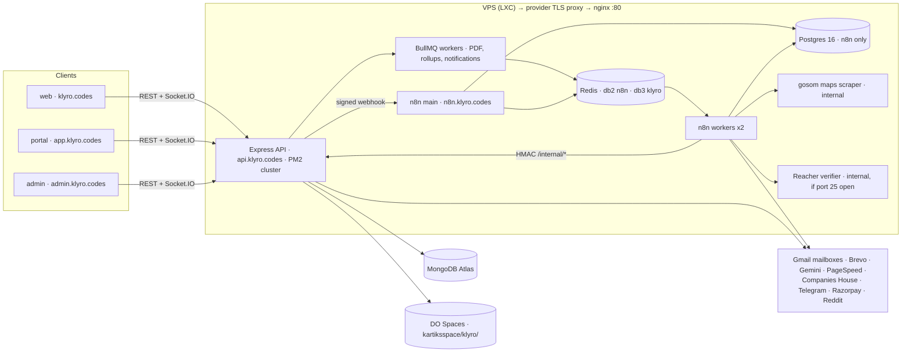
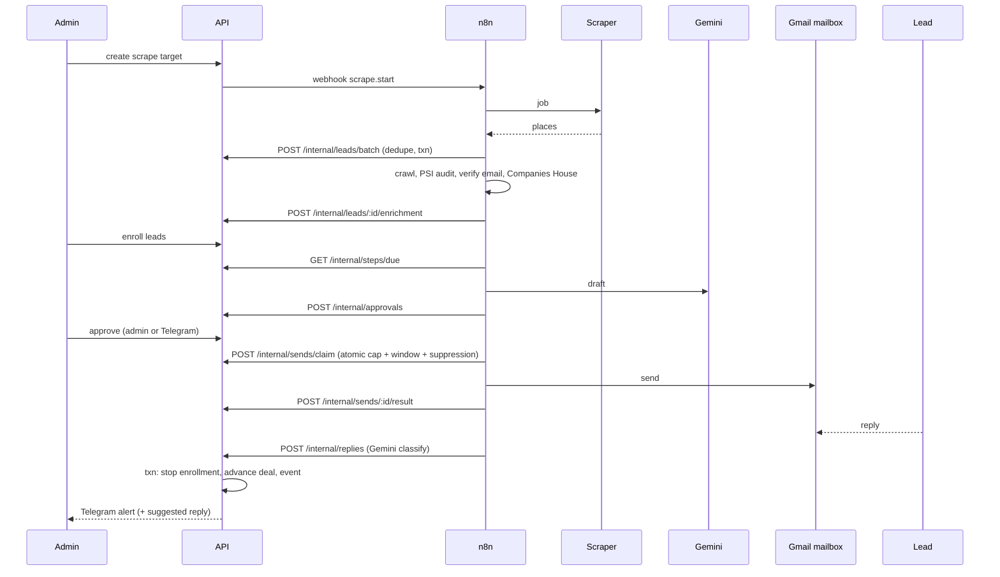

# Klyro — Implementation Plan

Klyro is a MERN platform that finds US/UK businesses, contacts them across channels automatically, and turns replies into quotes, projects and payments. It is managed from `admin.klyro.codes`, runs on the shared VPS next to JankiCare and BusinessOrbit without disturbing them, and is modelled so it can grow into a freelancer marketplace.

Conventions follow JankiCare: routes → controllers → services → models, validators, `withTransaction`, DO Spaces client, BullMQ, Socket.IO, Jest + mongodb-memory-server, PM2 + nginx + GitHub Actions.

---

## 1. Decisions

| Area | Decision |
|---|---|
| Stack | Plain MERN: MongoDB Atlas (replica set, transactions) + Mongoose 8, Express, React 19 + Vite + Tailwind v4, Node 24 |
| Orchestration | n8n 2.x in queue mode (main + 2 workers), Postgres 16 (n8n only), Redis |
| App email | Brevo (verification, resets, quotes, invoices, notifications, opted-in newsletter). Never for cold email — Brevo AUP bans scraped lists |
| Cold email | Separate Google Workspace account, 2 sending domains, 2 mailboxes each, ~3 weeks warmup, 30–40 sends/mailbox/day |
| Main mail | `kartik@klyro.codes` on Google Workspace (verified; MX, SPF, DKIM, DMARC live) |
| Files | DigitalOcean Spaces (`kartiksspace`, `sgp1`) under prefix `klyro/` |
| AI | Gemini free tier, with data minimisation (see §1a) |
| Alerts | Telegram bot (all alerts, inline action buttons). WhatsApp: click-to-chat link only; Cloud API alerts off (billed per message from 1 Oct 2026) |
| Markets | US + UK. UK: email incorporated companies only (PECR); sole traders excluded |
| Payments | Razorpay International + Skydo/Wise bank transfer details (Stripe India is invite-only) |
| Reddit | Monitor + AI draft; human posts with one click (automated DMs/comments break Reddit rules) |
| LinkedIn | AI drafts + one-click manual send (same flow as Reddit). Unipile (~$5/account/month) only if you later choose to pay |
| Domains | `klyro.codes` (web), `app.` (portal), `admin.`, `api.`, `n8n.` |
| Data model | Separate collections linked by ID, ACID transactions for multi-document writes, `workspaceId` on every record |

## 1a. Cost policy: free only

Every component is free or self-hosted. The only spend is what you already pay for, plus what cold email can't work without.

| Need | Free choice | Limit to know |
|---|---|---|
| Orchestration | n8n Community (self-hosted) | Fine for your own business; a SaaS for other users needs a commercial licence |
| App database | MongoDB Atlas M0 | 512 MB (tens of thousands of leads) |
| n8n DB / queue | Postgres 16, Redis on the VPS | — |
| Maps scraping | gosom/google-maps-scraper (self-hosted) | Concurrency 2 to avoid blocks |
| Email finding | Own crawler in n8n (HTTP Request + Code) | Home, contact, about, footer links; max 5 pages/site |
| Email verification | Syntax + MX + catch-all check; Reacher self-hosted if outbound port 25 is open | No paid verifier. Without port 25, expect a few more bounces; the 3% auto-pause protects mailboxes |
| Website audit | Google PageSpeed Insights API | 25,000 requests/day with a free key |
| UK company check | Companies House API | 600 requests / 5 min |
| AI | Gemini free tier | Rate-limited; Google may use prompts for training → send business data only, strip personal names/emails/signatures before calls |
| App email | Brevo free | 300/day |
| Cold email warmup | Built-in loop: your mailboxes email each other and your personal Gmail, mark important, reply | Weaker than paid tools; compensate with a slow ramp (5 → 30/day over 4 weeks) |
| Alerts | Telegram Bot API | Unlimited |
| Reddit / LinkedIn | AI drafts, you post/send manually | Reddit API free tier after approval |
| Booking | Cal.com hosted free plan | 1 user |
| Maps UI | Leaflet + OpenStreetMap tiles | Follow OSM tile usage policy (low volume is fine) |
| Monitoring | Uptime Kuma (self-hosted), Sentry free tier | Sentry 5k errors/month |
| Files / backups | DO Spaces (already paid) | — |
| Payments | Razorpay (no monthly fee, % per payment), bank details on invoices | Cost only when you earn |

Unavoidable spend: 2 sending domains (~$10/year each) and their Google Workspace mailboxes. Cold email from `klyro.codes` or free Gmail risks your main domain and account. Paid add-ons (Unipile, WhatsApp alerts, paid verifier, paid warmup) are kept as optional adapters in code, disabled by default.

---

## 2. Environment findings

- VPS `kartik-india-8gb`: unprivileged LXC container, Ubuntu 24.04, 4 vCPU / 8 GB (~7.5 GB free), 70 GB disk free.
- IPv4 is NAT'd (internal `10.10.10.13`, public `148.113.8.82`, SSH on 20011). Provider front proxy terminates TLS; nginx listens on :80 only. IPv6 shows `dadfailed` (unusable).
- Already running: nginx, Redis (localhost), PM2 apps `janki-backend`, `bocc-backend`, `boc-backend`, `boc-frontend`.
- Docker not installed; may not run without LXC nesting.
- Security gaps: SSH password + root login enabled, no firewall, no fail2ban.
- Workspace `klyro.codes`: verified, Gmail active. Prepayment still pending.
- JankiCare's transaction helper silently falls back to non-transactional writes. Klyro requires transactions and fails hard.

---

## 3. Architecture



Rule: n8n never writes to MongoDB directly. It goes through `/api/v1/internal/*` (HMAC-signed, idempotency key, transactional). Business rules, caps and suppression checks live in one tested place; n8n handles scheduling, outside calls and retries.

### Outreach flow



---

## 4. Repository layout (npm workspaces)

```
server/   src/{config,models,services,controllers,routes,validators,middleware,
              queues,events,socket,utils,
              integrations/{brevo,gemini,telegram,whatsapp,n8n,psi,companiesHouse,razorpay,unipile,reddit}}
          tests/{unit,integration}
web/      klyro.codes public site + pitch pages
portal/   app.klyro.codes client portal
admin/    admin.klyro.codes command center
shared/   schemas (Zod), enums (statuses, roles, channels), design tokens, Tailwind preset
n8n/      workflows/*.json (exported, version-controlled), credentials.md (names only)
infra/    compose or PM2 configs, nginx/*.conf, scripts/{backup,restore}.sh, SERVER.md
design-system/klyro/   MASTER.md + pages/*.md (UI UX Pro Max)
.github/workflows/{ci.yml,deploy.yml}
```

---

## 5. Data model (MongoDB)

Common: `workspaceId`, `createdBy`, timestamps; soft delete (`deletedAt`) where history matters. Money is `{ amountMinor: Int, currency: 'USD'|'GBP'|'INR' }`. `optimisticConcurrency: true` on deals, quotations, invoices, payments, enrollments.

| Area | Collections | Key fields / indexes / rules |
|---|---|---|
| Tenancy | `workspaces`, `users`, `memberships`, `sessions` | membership unique (workspaceId, userId); roles `super_admin`, `admin`, `client`, `freelancer`; sessions hold hashed refresh tokens, TTL |
| Security | `audit_logs`, `idempotency_keys`, `settings` | audit append-only; idempotency unique (scope, key), 48 h TTL, cached response; secrets AES-256-GCM |
| Leads | `organizations`, `contacts`, `leads`, `lead_sources`, `website_audits` | org unique sparse `placeId`, `domain`; `companyType`; contact `email`, `emailStatus`; lead `score`, `stage`, `timezone`, `country` |
| Sourcing | `scrape_targets`, `scrape_jobs` | queued → running → ingesting → enriched \| failed |
| Outreach | `mailboxes`, `templates`, `campaigns`, `sequence_steps`, `enrollments`, `messages`, `approvals`, `suppressions` | mailbox `dailyCap`, `sentToday`, `health`, `status` (warming/active/paused); enrollment unique (campaignId, leadId), active → replied \| completed \| stopped \| bounced; message unique `providerMessageId`; suppression unique (workspaceId, type, value) |
| Conversations | `conversations`, `notifications` | one thread per contact per channel |
| Pitch | `pitch_pages`, `pitch_events` | unique `slug` + unguessable token |
| Sales | `deals`, `quotations`, `quotation_items`, `agreements` | deal new → contacted → replied → call → quote → won \| lost; quotation draft → sent → accepted \| rejected \| expired \| superseded, `version` |
| Delivery (P2) | `projects`, `milestones`, `invoices`, `payments`, `files` | invoice draft → sent → partially_paid → paid \| void; payment unique `gatewayPaymentId` |
| Analytics | `events`, `metrics_daily` | events append-only, 180-day TTL; rollups unique (workspace, date, channel, campaign, mailbox) |
| P3 | `freelancer_profiles`, `assignments`, `payouts`, `reviews`, `portfolio_items` (P1) | reserved |

Status changes go through `utils/stateMachine.transition(doc, to, session)`: checked against an allowed map and written to `audit_logs` in the same transaction.

Must be transactional: lead batch ingest, send result, reply handling, quote acceptance (project + milestones + advance invoice), payment recording, lead merge.

---

## 6. API surface (`/api/v1`)

- Public: `auth/*`, `public/enquiries`, `public/project-requests`, `public/pitch/:slug`, `public/pitch/:slug/events`, `u/:token` (unsubscribe GET + one-click POST), `t/c/:token` (click redirect)
- Admin: `leads`, `organizations`, `scrape-targets`, `scrape-jobs`, `mailboxes`, `templates`, `campaigns`, `enrollments`, `approvals`, `inbox`, `deals`, `quotations`, `portfolio`, `analytics/*`, `automation/workflows` (n8n API proxy), `settings`, `audit-logs`, `files/presign`
- Portal (P2): `me/projects`, `me/quotations`, `me/invoices`, `me/conversations`
- Internal (n8n): `internal/leads/batch`, `internal/leads/:id/enrichment`, `internal/steps/due`, `internal/approvals`, `internal/sends/claim`, `internal/sends/:id/result`, `internal/replies`, `internal/bounces`, `internal/alerts`
- Webhooks: `webhooks/razorpay`, `webhooks/telegram` (`webhooks/whatsapp`, `webhooks/unipile` reserved for the optional paid adapters)

Internal calls require `X-Klyro-Timestamp` + `X-Klyro-Signature` (HMAC-SHA256 of timestamp + body, 5-minute window) and `Idempotency-Key`.

### Send limits
`sends/claim` does one atomic `findOneAndUpdate` on a mailbox where `status: 'active'`, `sentToday < dailyCap`, `lastSentAt < now - minGap`. In the same transaction it checks the suppression list (email, domain), the lead's local send window (`geo-tz` from lat/lng), rejects UK non-incorporated leads, and marks the message `sending`. A retry returns the same message. `sentToday` resets at midnight UTC.

### Mailbox rotation
n8n can't pick credentials dynamically, so sub-workflow `send-via-mailbox` has one Gmail node per mailbox, switched on the `mailboxId` returned by `claim`. Admin UI flags mailboxes not yet wired into n8n.

### Security
- argon2id (or bcrypt 12); access token 15 min, rotating refresh 30 days stored hashed; TOTP 2FA required for admins.
- helmet, per-origin CORS, Redis-backed rate limits, Turnstile + honeypot on public forms.
- n8n behind nginx basic auth or IP allowlist plus n8n login; `N8N_ENCRYPTION_KEY` backed up offline.
- Secrets only in server `.env` and GitHub Actions secrets; Spaces key scoped to the bucket.
- Separate ports, Redis DB and nginx file from JankiCare; JankiCare configs never touched.

---

## 7. UI

Rules live in `.kiro/steering/klyro-ui.md`; tokens in `design-system/klyro/MASTER.md` with overrides in `pages/admin.md` and `pages/portal.md` (generated with UI UX Pro Max). Motion and performance rules come from the "Website UI Tech Stack Analysis" PDF.

| Concern | web (site + pitch pages) | portal + admin |
|---|---|---|
| Framework | React 19 + Vite + Tailwind v4 | same |
| Smooth scroll | Lenis | native |
| Scroll animation | GSAP + ScrollTrigger (`scrub: 1`), Flip | none |
| UI state animation | Motion | Motion, subtle (dialogs, toasts, reorder) |
| Custom cursor | `gsap.quickTo`, `(pointer: fine)` only | no |
| Components | custom on Radix primitives | shadcn/ui, TanStack Table, dnd-kit, Recharts, Lucide |
| Forms | React Hook Form + Zod (schemas in `shared/`), floating labels | same |
| Data | TanStack Query | TanStack Query + Socket.IO |

Non-negotiables: animate only `transform`/`opacity`; `will-change` applied and removed per animation; `100dvh`; container queries; self-hosted variable fonts; AVIF/WebP from the Spaces CDN; `prefers-reduced-motion` and `(pointer: coarse)` fallbacks; 44×44 px touch targets; WCAG 2.2 AA. Never sign browser requests with a secret — HMAC is server-to-server only.

Public site sections: full-screen typographic hero with live IST time chip → numbered services (00–03) with staggered reveal → work with Catalog/Card Flip toggle and case studies → minimal contact/project form. Pitch pages reuse these components.

Targets: Lighthouse performance ≥ 90, accessibility ≥ 95, CLS < 0.05.

Server-side meta: Express serves `web/dist` and injects per-route title, description and OG image for `/pitch/:slug` and blog routes, so link previews and SEO work without Next.js.

---

## 8. Tasks

Each task is test-first, CI green, deployed, and ends with a demo.

### Phase 0 — Foundations (week 1)

**T1. VPS hardening and capability check**
- Disable SSH password and root-password login (second session held open while testing); fail2ban.
- Test `docker run hello-world` (nesting), outbound port 25 (Reacher), provider TLS for `api.klyro.codes`.
- Allocate Redis DBs (JankiCare stays on 0). Write `infra/SERVER.md`.
- Tests: key login works, password refused; scripted curl of all JankiCare/BusinessOrbit URLs returns usual codes.
- Demo: hardened server, capability report, `api.klyro.codes` reaches nginx over HTTPS.

**T2. Monorepo scaffold, API skeleton, CI/CD**
- npm workspaces, ESLint, Prettier, Husky. Env validation, winston, errorHandler, apiResponse, asyncHandler.
- `withTransaction` requiring a replica set. `GET /health` (Mongo + Redis).
- PM2 ecosystem on port 4100, `infra/nginx/klyro.conf`, GitHub Actions lint → test → SSH deploy.
- `shared/` design tokens + Tailwind preset + font loading.
- Tests: supertest `/health`; MongoMemoryReplSet commit + rollback.
- Demo: `https://api.klyro.codes/health` ok, deployed from a push to `main`.

**T3. n8n queue-mode stack**
- Docker Compose if nesting works; otherwise Postgres 16 via apt, n8n via npm (pinned 2.x), PM2 `n8n-main` + `n8n-worker` ×2 with `EXECUTIONS_MODE=queue`, `QUEUE_BULL_REDIS_DB=2`, shared `N8N_ENCRYPTION_KEY`.
- Execution pruning 7 days, binary data in memory, basic auth on `n8n.klyro.codes`, memory caps.
- Tests: smoke workflow runs on a worker; killing one worker lets the other take the job.
- Demo: n8n UI behind auth, test workflow executes on a worker.

Parallel admin tasks this week: buy 2 sending domains, set up the second Workspace account and start warmup, create Telegram bot, apply for Reddit API, Companies House API key, Google Cloud project (Gmail API + PageSpeed key), Gemini API key (free tier), finish Workspace prepayment.

### Phase 1 — Outreach engine + CRM (weeks 2–8)

**T4. Core data layer** — workspaces, users, memberships, audit_logs, idempotency_keys, settings; `stateMachine`, `money`, `crypto` (AES-256-GCM), idempotency middleware, tenant scope; seed workspace + super-admin.
Tests: invalid transitions rejected; audit rolls back with its transaction; idempotent replay; tamper detection; cross-workspace isolation.

**T5. Authentication with Brevo** — register → OTP + magic link → verify → login; refresh rotation with reuse detection; forgot/reset; TOTP 2FA for admins; Turnstile; lockout after 5 failures in 15 min. Authenticate `klyro.codes` in Brevo (DKIM + `include:spf.brevo.com` in SPF).
Tests: every flow with mocked Brevo; expired/used OTP rejected; refresh reuse revokes the session family.

**T6. Admin app shell** — shadcn/ui on tokens; axios with 401 refresh; protected routes; login, 2FA QR setup, layout, dashboard placeholder; Settings (business profile + postal address for CAN-SPAM, masked API keys, send windows); audit log viewer.
Tests: Vitest + Testing Library for guards/forms; API never returns secrets in plain text.

**T7. File storage on Spaces** — reuse JankiCare `spaces.js` pattern with `klyro/` prefix (`private/…`, `public/…`, `backups/…`); `POST /files/presign` → `POST /files/:id/complete`; `files` collection; MIME allowlist and size limit; bucket CORS for app + admin.
Tests: disallowed type/size rejected; completion checks object exists; private files only via signed links.

**T8. n8n ↔ API integration** — `internalAuth` (HMAC, timestamp window, idempotency key required); outbound signed webhooks + n8n REST client; reusable n8n "Klyro API" sub-workflow; Telegram client + `/internal/alerts`.
Tests: bad/old signatures rejected; replay returns the same result.
Demo: n8n ping → API → Telegram message.

**T9. Leads domain + admin lead views** — organizations, contacts, leads, lead_sources, suppressions; dedupe on placeId, normalized phone (`libphonenumber-js`), registrable domain; transactional merge; CSV import via BullMQ; lead table (server filters, pagination), lead detail timeline, tags, notes.
Tests: idempotent dedupe ingest; atomic merge; suppressed contacts flagged.

**T10. Google Maps scraping** — gosom scraper (Go binary + Playwright Chromium) as PM2 app on 127.0.0.1, concurrency 2; scrape_targets (country, cities, categories, keywords, radius, filters, schedule) + scrape_jobs; n8n H1a submit → poll → map → batch ingest in chunks of 50; admin target builder (Leaflet + OSM), preview count, run/schedule, live progress over Socket.IO.
Tests: target validation; job transitions; golden-file mapping test.
Demo: "dentists in Austin, TX, rating ≥ 4.0, has website" → leads appear live.

**T11. Enrichment + scoring** — crawl homepage, then `/contact`, `/about` and footer links (max 5 pages/site, robots.txt, 10 s timeout) for emails and socials; drop image-file and placeholder matches (`example.com`, `sentry.io`, `*.png`), prefer emails on the business's own domain, mark "not found" when empty; PageSpeed Insights, SSL, tech fingerprint, viewport → `website_audits`; email syntax + MX + catch-all check, then Reacher if port 25 is open (no paid verifier); Companies House for UK `companyType`; timezone from lat/lng; `scoring.service` with weights editable in Settings; audit panel + score breakdown in admin.
Tests: table-driven scoring; Companies House matching; transactional enrichment; mocks for Reacher/PSI.

**T12. Mailboxes, templates, sequences, enrollments** — mailbox status/cap/n8n branch ID; templates with variables and variants; campaigns; sequence steps (delay in business days in the lead's timezone — never weekends or local public holidays; channel; template; stop rules); bulk enroll skipping suppressed, UK non-Ltd, no valid email, already enrolled; admin UIs.
Tests: eligibility rules; unique (campaign, lead); next due time in lead timezone.

**T13. AI drafting + approval queue** — Gemini structured JSON (subject, body, personalization notes) from lead + audit + template + tone; guardrails (length, no invented facts vs audit fields, spam words); H2 cron → steps/due → draft → approvals; admin queue (approve, edit, reject, regenerate, bulk) with live updates; Telegram inline approve/reject.
Tests: prompt snapshots; guardrail validator; idempotent approval across UI and Telegram.

**T14. Sending with enforced limits** — `sends/claim` + `sends/:id/result`; every message carries a hidden `X-Klyro-Msg: <messageId>` header and the stored Gmail `threadId`/`Message-ID`, and follow-ups are sent as replies in the same thread (`In-Reply-To`/`References`), so replies map back to their campaign; plain-text-first HTML, `List-Unsubscribe` + `List-Unsubscribe-Post`, postal address footer, `{{pitchUrl}}`, click tracking via `klyro.codes/t/c/:token`, open tracking off; H3 every 5 min with 60–240 s jitter; unsubscribe page + one-click endpoint; daily cap reset.
Tests: concurrent claims never exceed cap; suppressed/out-of-window refused; retry never double-sends; unsubscribe stops all active enrollments for the contact.
Demo: live sequence to your own Gmail/Outlook test inboxes; headers pass; one-click unsubscribe works.

**T15. Replies, bounces, alerts** — Gmail Trigger per mailbox (Gmail filter label `klyro/replies`, `-from:me`) → `/internal/replies`, matched by `threadId`, then `In-Reply-To`/`References`, then `X-Klyro-Msg`; strip quoted history, signature and personal details before Gemini sees the text; Gemini returns JSON `{class, confidence, reasoning, suggestedReply}` with classes interested, question, objection, not now, not interested, out of office, referral, unsubscribe; unparseable or low-confidence output falls back to `needs_review`; one transaction stops enrollment, creates/advances deal, writes event; DSN bounce parsing marks contact invalid and updates mailbox stats; Telegram alert for every reply, with the suggested reply and Approve/Edit buttons for interested and question.
Tests: reply matching (each fallback path); quote stripping on real Gmail/Outlook samples; JSON fallback; class → action table; rollback on failure.
Demo: reply "sounds good, what's the cost?" → sequence stops, deal in Replied, Telegram alert with a suggested answer.

**T16. Mailbox health + warmup** — hourly 7-day bounce/complaint rates; auto-pause above 3% bounces or 0.1% complaints with alert; warmup ramp raises `dailyCap` by day (5 → 30 over 4 weeks); free built-in warmup workflow (mailboxes exchange short natural emails with each other and your personal Gmail, which open, mark important, move out of spam and reply); Postmaster Tools manual input; health panel.
Tests: pause thresholds; ramp schedule.

**T17a. Design direction (≈1 week, before T17)** — moodboard from the two reference portfolios; Klyro brand (logo, palette, type) applied to `design-system/klyro/`; coded prototypes of hero, work and contact; admin component inventory.

**T17. Public site + inbound enquiries** — `web/`: landing, services, portfolio (from `portfolio_items` admin manager), enquiry and project-request forms (Turnstile, honeypot, uploads via T7), Cal.com embed, legal pages (privacy, terms, unsubscribe, DPDP/GDPR, cookies); Lenis + GSAP + cursor module + fallbacks; Express meta injection; replace Spaceship wildcard redirect with real records; H6 enquiry → Gemini qualification → Brevo auto-reply → deal → alert.
Tests: validation and spam blocking; qualification mapping; per-route meta; Lighthouse budgets in CI.

**T18. Pitch pages + tracking** — `pitch_pages` created at enrollment (slug + token); sections from audit, matching portfolio items, demo embeds (iframe/video/Expo Snack); server-side meta so previews show the lead's name and logo; `pitch_events` via `sendBeacon`; H5 first view / return visit → alert + score bump.
Tests: token required; per-session event dedupe; idempotent score bump.

**T19. CRM, quotes, unified inbox** — deal kanban (dnd-kit, state-machine-checked moves, values); quote builder (line items, discount, tax, currency, validity, pdfkit PDF, sent via Brevo with view link); email inbox with reply through the original mailbox in the same thread (n8n `reply-via-mailbox`), pre-filled with the Gemini suggested reply from T15 for you to edit and send; tasks and notes.
Tests: minor-unit totals; version supersede; invalid moves rejected; reply stays in thread.

**T20. Analytics + automation panel** — services write `events`; BullMQ nightly + intraday rollups into `metrics_daily`; funnels by channel, campaign, variant, city, category, mailbox, date (Recharts); home dashboard; n8n panel (list, enable/disable, run, executions, retry).
Tests: rollups match raw events (property test); unit test per metric.

**T21. Backups, monitoring, restore drill** — nightly `mongodump` + `pg_dump` gz to `klyro/backups/`, 30-day retention; n8n workflows exported and committed by a GitHub Action; Uptime Kuma; Sentry (server + frontends); H11 health check alert.
Tests: backup dry run; restore to a scratch DB and compare counts.

**T22. Go-live hardening + first campaign** — security review (headers, CORS, rate limits, secret scan, `npm audit`); autocannon load test of `sends/claim` and public forms; confirm JankiCare latency unchanged; pre-flight (warmup ≥ 3 weeks, DNS, suppressions seeded, postal address set); launch first campaign at a low cap.

### Phase 2 — Client lifecycle + channels (weeks 9–14)

**T23. Client portal core** — `portal/` with client role; dashboard, project requests, versioned quotes (accept / request changes / reject); Socket.IO chat with Redis adapter and attachments; notifications in-app + Brevo; quote acceptance transaction → project + milestones + advance invoice.

**T24. Agreements, projects, milestones, file vault** — agreement from `work-agreement.html` template, typed e-signature with IP, user agent and hash, PDF to Spaces; milestone client approval triggers next invoice; per-project vault.

**T25. Payments** — Razorpay International links/orders; webhook signature + idempotency on `gatewayPaymentId`; Skydo/Wise bank details on invoices, manual mark-paid with proof; export invoice (LUT zero-rated — confirm with CA); H7/H8 reminders.

**T26. Reddit intent monitor** (after API approval) — H9 polls approved subreddits/keywords via OAuth; keyword pre-filter and dedupe by post ID before AI (saves Gemini quota); Gemini intent score + draft; approval item with "Open & post" and "mark posted"; reply tracking within rate limits. No third-party Reddit scrapers (e.g. Apify) — they bypass Reddit's API approval and break its terms.

**T27. LinkedIn (manual-assist, free)** — `linkedin` sequence steps create tasks instead of sending: Gemini drafts the connection note (≤ 200 chars) and follow-ups; the task card has "Copy + open profile" and "Mark sent/accepted/replied"; replies you paste in are classified like email; daily task cap of 20. Unipile adapter stays stubbed and disabled for later.

**T28. Growth features** — AI estimate, public website audit tool, blog/SEO, pricing, chat widget; A/B tests with significance, pitch heatmap, revenue attribution, weekly report; team roles, tasks, staging; data deletion and retention jobs.

### Phase 3 — Growth + marketplace (week 15+)

**T29. Marketplace foundations** — freelancer role/profile with KYC, assign or bid on milestones, freelancer workspace, Razorpay Route payouts with commission, reviews; Discord monitor, cross-channel sequences, support tickets, testimonials. A SaaS version for other users needs a commercial n8n licence or moving sending into BullMQ.

### Timeline

| Weeks | Tasks | Outcome |
|---|---|---|
| 1 | T1–T3 | Secure server, n8n running, warmup started |
| 2–3 | T4–T8 | Auth, admin shell, files, n8n ↔ API |
| 3–4 | T9–T11 | Leads scraped, enriched and scored |
| 5–6 | T12–T16 | Drafting, approval, sending, replies, alerts; first campaign ~week 6 |
| 7–8 | T17a–T22 | Public site, pitch pages, CRM, analytics, backups, go-live |
| 9–14 | T23–T28 | Portal, payments, Reddit, LinkedIn, growth |
| 15+ | T29 | Marketplace |

---

## 9. Feature index (by phase)

- **P1:** A1–A4, A6–A8, A12; B1, B2, B4–B9; C1–C3, C6, C13; D1–D8, D12–D14; E1–E5, E7–E12, E16; F1–F9, F12–F15, F17; G1–G4, G9; H1–H6, H11; I1, I2, I5, I6; J1–J8.
- **P2:** A5, A9–A11, A13; B3; C4, C5, C7–C11; D9, D11; E6, E13, E14; F10, F11, F16, F18; G5, G6, G8; H7–H10, H12; I3, I4; J9.
- **P3:** C12, C14; D10; E15; G7; K1–K6.

D14 = UK Companies House check (email incorporated companies only).

---

## 10. Open decisions

1. Sending path: n8n Gmail node per mailbox (planned) vs API sends via nodemailer and n8n only schedules.
2. TypeScript for `web/`, `portal/`, `admin/`, `shared/` with JavaScript server, or TypeScript everywhere.
3. Sending domain names (2) and USD/GBP pricing packages.
